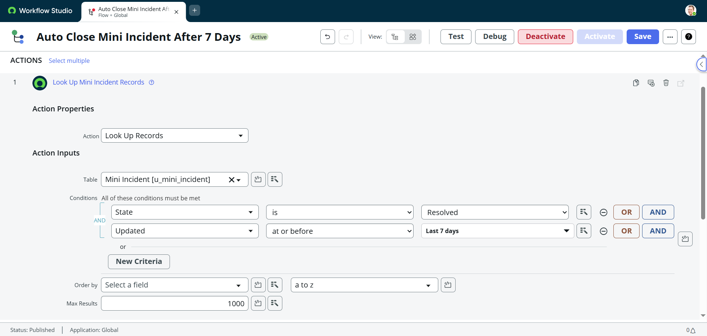

# 🚀 Mini Incident Management System - ServiceNow

This is a mini project created in ServiceNow to simulate a simple Incident Management System.  
It covers basic Incident functionalities like creating incidents, assigning, resolving, email notifications, reporting, and dashboarding.

---

### 🚀 Features

#### ✅ Core Functionality
- **Create and Track Incidents**
  - Custom table `u_mini_incident`
  - Auto-incremented `Number` field for each incident
  - Fields: Short Description, Description, Category, Impact, Urgency, Priority, Assigned To, State, Resolution Notes, etc.
  - Mandatory and Read-only fields based on state using UI Policies

- **Priority Calculation Logic**
  - Automatically sets `Priority` based on combinations of `Impact` and `Urgency` (High, Moderate, Low)

#### 🧠 Business Rules
- On **Insert**, set the State to **"New"**
- If **Assigned To is populated** and State is still **"New"**, automatically change it to **"In Progress"**
- When **Resolution Notes** are filled, automatically set State to **"Resolved"**
- On update, if **State changes to Resolved**, set the **Resolved By** and **Resolved At** fields

#### 📊 Dashboard and Reporting
- Two reports created:
  - Incidents by Category
  - Incidents by State
- Added both reports to a **custom Dashboard**

#### 📬 Notifications
- Email notification sent to Assigned User when they are assigned to an incident
- Email can be seen in the Outbox for testing

#### ⏳ Automation with Flow Designer
- When an incident is **Resolved**, a Flow runs and sets the state to **Closed** after 7 days automatically

#### 🧠 GlideAjax + Script Include Functionality
- Feature: **Auto-populate Description based on selected Category**
  - Client Script triggers on Category change
  - Sends selected Category to Script Include via `GlideAjax`
  - Script Include returns a description text which gets populated in the Description field

📁 Related Files:
- `/ScriptInclude-GlideAjax/CategoryHelper.js`
- `/ScriptInclude-GlideAjax/CategoryClientScript.js`

---

## 🛠️ Features

- Create and manage Mini Incidents.
- Auto-generate Incident Number (INC0010001, INC0010002, etc.)
- Impact, Urgency, and automatic Priority calculation (1-High, 2-Moderate, 3-Low).
- Business Rules to update resolved fields.
- Email notification sent to "Assigned To" user.
- Two reports created:
  - Incidents Created per Day
  - Incidents by State
- Dashboard displaying both reports.
- GitHub version-controlled project with documentation and screenshots.

---

## 🏗️ Technologies Used

- **ServiceNow** (Yokohama version)
- **Flow Designer / Business Rules**
- **Email Notifications**
- **Reports and Dashboards**
- **GitHub** for version control

---

## 🧩 Table Structure (`u_mini_incident`)

| Field Name         | Type            | Details                   |
|:-------------------|:----------------|:---------------------------|
| Number             | String           | Auto-generated             |
| Short Description  | String           | Mandatory                  |
| Description        | String           |                            |
| State              | Choice           | New, Assigned, In Progress, Resolved, Closed |
| Assigned To        | Reference (User) | User who is assigned       |
| Impact             | Choice           | 1-High, 2-Moderate, 3-Low   |
| Urgency            | Choice           | 1-High, 2-Moderate, 3-Low   |
| Priority           | Integer          | Auto-calculated             |
| Resolved By        | Reference (User) | Auto-populated when resolved |
| Resolved At        | Date/Time        | Auto-populated when resolved |
| Resolution Notes   | String           | Visible when state changes to Resolved |
| Created By         | Reference (User) | Auto-populated             |
| Created On         | Date/Time        | Auto-populated             |

---

## 📋 Business Rules

- **BR Set Resolved Info:**  
  When the Incident is moved to the Resolved state:
  - Set Resolved By = Current User
  - Set Resolved At = Current Date/Time

- **BR Send Assignment Email:**  
  When an Incident is assigned:
  - Send email notification to "Assigned To" user.

---

## 📊 Reports Created

- **Incidents Created per Day Report**  
  (List of all Incidents Created per Day)

- **Incidents by State Report**  
  (Pie Chart showing Incident distribution per state)

---

## 📈 Dashboard

- **Mini Incident Dashboard** created showing:
  - Incidents Created Day by Day
  - Incidents by State

---

## 📸 Screenshots

### 1. Table Structure

### 2. List View

### 3. Form View

### 4. Business Rules

- **If State==Resolved**
  
  
  
- **Setting Priority based on Urgency & Impact**
  
  

### 5. Reports

- **Incidents by State**
  
  
  
- **Incidents Day by Day**
  
  

### 6. Dashboard View

### 7. Email Notification Log

---

## ⚙️ Scheduled Flow to Auto-Close Incidents

This flow checks daily for any incidents that are in the **Resolved** state for over 7 days and automatically changes their state to **Closed**.

### 🔄 Flow Details:
- **Trigger Type:** Scheduled (Daily)
- **Conditions:**
  - State is `Resolved`
  - Resolved At is on or before Today - 7 days
- **Action:** Update record to set State = `Closed`

### 📸 Screenshots

| Description             | Screenshot |
|-------------------------|------------|
| Flow Properties         |  |
| Trigger Configuration   |  |
| Condition Set           |  |
| Action: Update State    |  |

---

## 💡 Feature: Auto-Set Description via Category (GlideAjax + Script Include)

This feature demonstrates the use of **Client Script** and **Script Include** with GlideAjax.

- When the **Category** field is changed, a client script sends the selected value to the Script Include using `GlideAjax`.
- The Script Include returns a default description for that category.
- The client script sets the returned value to the **Description** field.

📁 Files:
- `/ScriptInclude-GlideAjax/CategoryHelper.js`
- `/ScriptInclude-GlideAjax/CategoryClientScript.js`

🔁 Technologies Used: GlideAjax, Script Include, Client Script (onChange)

---

## 🔄 REST Integration Demo

This project includes a basic REST integration using [webhook.site](https://webhook.site) to simulate sending incident data to an external endpoint.

### ✔️ How It Works
- A REST Message is triggered via Business Rule whenever an incident is updated.
- JSON payload is posted to an external endpoint with details like:
  - Incident Number
  - Short Description
  - State

### 📸 Screenshots

| Description                    | Screenshot |
|-------------------------------|------------|
| REST Message Config with Header|  |
| HTTP Method Content            |  |
| Business Rule Script           |  |
| Webhook Response Received      |  |

---

## 🎯 Future Enhancements

- Add Flow Designer automation for Notifications.
- Add SLAs for resolution times based on Impact/Urgency.
- Create Service Catalog Item for submitting Mini Incidents.
- Role-based access control (ACLs).

---

## 🧠 Author

- Faraz Shariq.
- ServiceNow CSA | CAD | CIS-ITSM Certified
- Associate Software Engineer
- LinkedIn: www.linkedin.com/in/faraz-shariq

---
